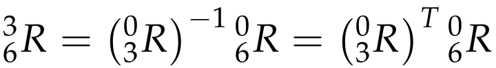
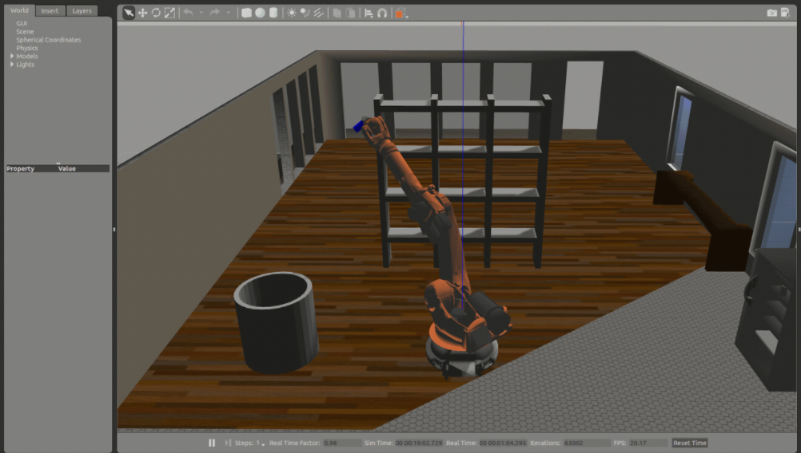

# Project: Kinematics Pick & Place

## Writeup

This is a writeup for the Udacity's Robotics Nanodegree's Pick and Place Project. This directory is a ROS package and instructions for setup are available in `README` file


[//]: # "Image References"

[image1]: ./misc_images/misc1.png
[image2]: ./misc_images/misc3.png
[image3]: ./misc_images/misc2.png

## [Rubric](https://review.udacity.com/#!/rubrics/972/view) Points
Rubric consists of 3 points:

- Writeup

- Kinematics Analysis

- Project Implementation

---
### Writeup / README

#### 1. Provide a Writeup / README that includes all the rubric points and how you addressed each one.  You can submit your writeup as markdown or pdf.  

You're reading it!

---

### Kinematic Analysis
#### 1. Run the forward_kinematics demo and evaluate the kr210.urdf.xacro file to perform kinematic analysis of Kuka KR210 robot and derive its DH parameters.


- Above shown is a Kuka KR210 robot

- The `kr210.urdf.xacro` file is located in directory `kuka_arm/urdf/`

- Universal Robotic Description Format (URDF) file contains the detail description of the links and joints

- Following is an example of `urdf` file written in `xml` which includes the description of links

  

- A robot consists of various joints and links. All the links are connected in a particular pattern to cover the workspace around the robot.

- The first link is known as `base_link` while the last link, in most cases, known as `end-effector`

- **Forward kinematics** refers to the use of the kinematic equations of a robot to compute the position of the end-effector from specified values for the joint parameters

- Consider a 2-link robot, the position of link-2 with respect to link-1 can be completely described by using 6-parameters (3 Rotations and 3 Translations)

- If number of links are increased, as in the case of Kuka-KR210 (7-links), it becomes very complex to describe the position of end-effectors with respect to base_link

- To simplify this problem, D-H parameters are used.

- With D-H parameter, we can completely describe the relation of 2-links using only 4-parameters.

- Following are the D-H Parameters:

  - **Link Length:** a(i-1) = Zi-1 - Zi along the X(i-1) axis

  - **Link Offset:** d(i) = X(i-1) - X(i) along Z(i) axis

  - **Link Twist: ** alpha(i-1) = angle from Z(i-1) to Z(i) measured about Xi-1 using right hand rule

  - **Joint Angle:** angle from X(i-1) to X(i) measured about Zi using right hand rule. all joint angles will be zero at initial Robot state in KR210 except joint 2 which has a -90 degree constant offset between X(1) and X(2)

    where i=link number

- Following video shows the conventions for D-H parameters and how to calculate D-H parameters for a robot.

### [D-H Parameter Video](https://www.youtube.com/embed/rA9tm0gTln8)

<iframe width="900" height="506" src="https://www.youtube.com/embed/rA9tm0gTln8" frameborder="0" allow="accelerometer; autoplay; encrypted-media; gyroscope; picture-in-picture" allowfullscreen></iframe>

- Following is diagram representing link and joints of above shown robot


- Following is a procedure to find out DH parameters

  ```latex
  1. Label all joints from {1, 2, … , *n*}.
  
  2. Label all links from {0, 1, …, n} starting with the fixed base link as 0.
  
  3. Draw lines through all joints, defining the joint axes.
  
  4. Assign the Z-axis of each frame to point along its joint axis.
  
  5. Identify the common normal between each frame \hat{Z}_{i-1}*Z*^*i*−1 and frame \hat{Z}_{i}*Z*^*i* .
  
  6. The endpoints of "intermediate links" (i.e., not the base link or the end effector) are associated with two joint axes, {i} and {i+1}. For *i* from 1 to *n-1*, assign the \hat{X}_{i}*X*^*i* to be …
  
     ​	For skew axes, along the normal between \hat{Z}_{i}*Z*^*i* and \hat{Z}_{i+1}*Z*^*i*+1 and pointing from {*i*} to {*i+1*}.
  
     ​	For intersecting axes, normal to the plane containing \hat{Z}_{i}*Z*^*i* and \hat{Z}_{i+1}*Z*^*i*+1.
  
     ​	For parallel or coincident axes, the assignment is arbitrary; look for ways to make other DH parameters equal to zero.
  
  7. For the base link, always choose frame {0} to be coincident with frame {1} when the first joint variable ({\theta}_{1}*θ*1 or {d}_{1}*d*1) is equal to zero. This will guarantee that {\alpha}_{0}*α*0 = {a}_{0}*a*0 = 0, and, if joint 1 is a revolute, {d}_{1}*d*1 = 0. If joint 1 is prismatic, then {\theta}_{1}*θ*1= 0.
  
  8. For the end effector frame, if joint *n* is revolute, choose {X}_{n}*X**n* to be in the direction of {X}_{n-1}*X**n*−1 when {\theta}_{n}*θ**n* = 0 and the origin of frame {*n*} such that {d}_{n}*d**n* = 0. 
  ```

- Following is the D-H parameter table for the above robot. The link lengths can be measured in `gazebo` as well as can be found out in `urdf` files.

  | Links |  i   | alpha(i-1) | a(i-1) | d(i)  | theta(i) |      |
  | :---: | :--: | :--------: | :----: | :---: | :------: | ---- |
  | 0->1  |  1   |     0      |   0    | 0.75  |    q1    |      |
  | 1->2  |  2   |    -90     |  0.35  |   0   |  -90+q2  |      |
  | 2->3  |  3   |     0      |        | 1.25  |    q3    |      |
  | 3->4  |  4   |    -90     | -0.05  |  1.5  |    q4    |      |
  | 4->5  |  5   |     90     |   0    |   0   |    q5    |      |
  | 5->6  |  6   |    -90     |   0    |   0   |    q6    |      |
  | 6->7  |  7   |     0      |   0    | 0.303 |    q7    |      |

- Code

```python
import numpy as np
from numpy import array
from sympy import symbols, cos, sin, pi, simplify, sqrt, atan2, pprint
from sympy.matrices import Matrix

DH_Table = {alpha0:      0, a0:      0, d1:  0.75, q1:        q1,
            alpha1: -pi/2., a1:   0.35, d2:     0, q2: -pi/2.+q2,
            alpha2:      0, a2:   1.25, d3:     0, q3:        q3,
            alpha3: -pi/2., a3: -0.054, d4:   1.5, q4:        q4,
            alpha4:  pi/2., a4:      0, d5:     0, q5:        q5,
            alpha5: -pi/2., a5:      0, d6:     0, q6:        q6,
            alpha6:      0, a6:      0, d7: 0.303, q7:         0}
```

---

#### 2. Using the DH parameter table you derived earlier, create individual transformation matrices about each joint. In addition, also generate a generalized homogeneous transform between base_link and gripper_link using only end-effector(gripper) pose.

- Individual Transformation Matrices of two consecutive links is given by:

  

- Code for the following

  ```python
  # Function to return homogeneous transform matrix
  def TF_Mat(alpha, a, d, q):
      TF = Matrix([[            cos(q),           -sin(q),           0,             a],
                   [ sin(q)*cos(alpha), cos(q)*cos(alpha), -sin(alpha), -sin(alpha)*d],
                   [ sin(q)*sin(alpha), cos(q)*sin(alpha),  cos(alpha),  cos(alpha)*d],
                   [                 0,                 0,           0,             1]])
      return TF
  ```

- Transformation Matrices for all the links:

```python
T0_1 = TF_Matrix(alpha0, a0, d1, q1).subs(DH_Table)
T1_2 = TF_Matrix(alpha1, a1, d2, q2).subs(DH_Table)
T2_3 = TF_Matrix(alpha2, a2, d3, q3).subs(DH_Table)
T3_4 = TF_Matrix(alpha3, a3, d4, q4).subs(DH_Table)
T4_5 = TF_Matrix(alpha4, a4, d5, q5).subs(DH_Table)
T5_6 = TF_Matrix(alpha5, a5, d6, q6).subs(DH_Table)
T6_EE = TF_Matrix(alpha6, a6, d7, q7).subs(DH_Table)
```

- Printing output of each transformation matrix individually,

```python
T0_1 = Matrix([ [1.00000000000000, 0, 0, 0], 
				[0, 1.00000000000000, 0, 0], 
				[0, 0, 1.00000000000000, 0.750000000000000], 
				[0, 0, 0, 1.00000000000000]])

T1_2 = Matrix([ [-0.e-106, 1.00000000000000, 0, 0.350000000000000], 
				[0, 0, 1.00000000000000, 0], 
				[1.00000000000000, 0.e-117, 0, 0], 
				[0, 0, 0, 1.00000000000000]])

T2_3 = Matrix([ [1.0, 0, 0, 1.25000000000000], 
				[0, 1, 0, 0], 
				[0, 0, 1.00000000000000, 0], 
				[0, 0, 0, 1.00000000000000]])

T3_4 = Matrix([ [1.00000000000000, 0, 0, -0.0540000000000000], 
				[0, 0, 1.00000000000000, 1.50000000000000], 
				[0, -1.00000000000000, 0, 0], 
				[0, 0, 0, 1.00000000000000]])

T4_5 = Matrix([ [1.00000000000000, 0, 0, 0], 
				[0, 0, -1.00000000000000, 0], 
				[0, 1.00000000000000, 0, 0], 
				[0, 0, 0, 1.00000000000000]])

T5_6 = Matrix([ [1.00000000000000, 0, 0, 0], 
				[0, 0, 1.00000000000000, 0], 
				[0, -1.00000000000000, 0, 0], 
				[0, 0, 0, 1.00000000000000]])

T6_EE = Matrix([[1.00000000000000, 0, 0, 0], 
				[0, 1.00000000000000, 0, 0], 
				[0, 0, 1.00000000000000, 0.303000000000000], 
				[0, 0, 0, 1.00000000000000]]) 
```

- Generalized Homogenous Transform between base_link and end-effector is calculated by performing intrinsic transformations by pre-multiplying all individual joints transformation matrices

```python
T0_EE = T0_1 * T1_2 * T2_3 * T3_4 * T4_5 * T5_6 * T6_EE

# After printing output
T0_EE =[[0, 0, 1, 2.15300000000000],
		[0, -1, 0, 0],
		[1, 0, 0, 1.94600000000000],
		[0, 0, 0, 1]]  
```

---

#### 3. Decouple Inverse Kinematics problem into Inverse Position Kinematics and inverse Orientation Kinematics; doing so derive the equations to calculate all individual joint angles.

- **Inverse Kinematics** is a process of finding the joint parameters using the position of end-effectors
- The last three joints in KUKA KR210 robot (Joint_4, Joint_5, and Joint_6) are revolute and their joint axes intersect at a single point (Joint_5), hence we have a case of spherical wrist with joint_5 being the common intersection point; the wrist center (**WC**). This allows us to kinematically decouple the IK problem into **Inverse Position** and **Inverse Orientation** problems.
- Using Inverse Position, we find 3 wrist joint angles from the pose orientation.
- Using Inverse Orientation, we can find 3 joint angles from the base

### Inverse Position Kinematics

- We have to find out center of wrist, given the end-effector coordinates
- First, we will find out end-effector's positions(**Px, Py, Pz**) and orientations (**Roll, Pitch, Yaw**)

```python
# Requested end-effector (EE) position
px = req.poses[x].position.x
py = req.poses[x].position.y
pz = req.poses[x].position.z

# store EE position in a matrix
EE = Matrix([[px],
			 [py],
			 [pz]])

# Requested end-effector (EE) orientation
(roll,pitch,yaw) = tf.transformations.euler_from_quaternion(
                        [req.poses[x].orientation.x,
                        req.poses[x].orientation.y,
                        req.poses[x].orientation.z,
                        req.poses[x].orientation.w])
```

- The rotation matrix for the end-effector is calculated by

```python
R_rpy = Rot(Z, yaw) * Rot(Y, pitch) * Rot(X, roll)
```

- Now, we need to account for a rotation discrepancy between DH parameters and Gazebo (URDF)


- The orientation difference correction is done by rotating z-axis by 180 degrees and then y-axis by -90 degrees

```python
R_z = Matrix([  [cos(np.pi), -sin(np.pi), 0, 0],
		[sin(np.pi),  cos(np.pi), 0, 0],
		[         0,           0, 1, 0],
		[         0,           0, 0, 1]])

R_y = Matrix([  [ cos(-np.pi/2),  0, sin(-np.pi/2), 0],
		[             0,  1,             0, 0],
		[-sin(-np.pi/2),  0, cos(-np.pi/2), 0],
		[             0,  0,             0, 1]])
R_corr = simplify(R_z * R_y)

ROT_EE = ROT_EE * R_corr
```

The obtained matrix will be the rotation part of the full homogeneous transform matrix as yellow highlighted in the following:


where **l**, **m** and **n** are orthonormal vectors representing the end-effector orientation along X, Y, Z axes of the local coordinate frame.

Since **n** is the vector along the **z-axis** of the **gripper_link**, we can say the following:


Where,

**Px, Py, Pz** = end-effector positions obtained from test case data

**Xwc, Ywc, Zwc** = wrist center positions that we are trying to find.

**d6** = link_6 length obtained from DH table (d6=0)

**d7** = end-effector length obtained from DH table (d7=0.303)

The same equation in vectorized version (d is the displacement):


```python
# Calculate Wrest Center
WC = EE - (0.303) * ROT_EE[:,2]
```

WC is now having position of wrist center (Wx, Wy, Wz).

To find 𝜃1, we need to project Wz onto the ground plane Thus,

**Theta1=atan2(Wy,Wx)**
As shown in the project guide, 

```python
# Calculate theat1
theta1 = atan2(WC[1],WC[0])
```

Using trigonometry, we can calculate **𝜃2 and 𝜃3**. 

Now since we have all three sides of the triangle known to us we can calculate all of the three inner angles of the triangle from the known three sides Using trigonometry (specifically the **Cosine Laws** SSS type).

```python
#Cosine Laws SSS to find all inner angles of the triangle
a = acos((-0.6875 + side_b*side_b) / (2.5*side_b))
b = acos(( 3.8125 - side_b*side_b) / (3.75))
c = acos(( 0.6875 + side_b*side_b) / (3.0*side_b))
```

Finally we calculate **𝜃2** and **𝜃3**

```python
theta2 = pi/2 - a - atan2(WC[2]-0.75, sqrt(WC[0]*WC[0]+WC[1]*WC[1])-0.35)
theta3 = pi/2 - (b+0.036) # 0.036 accounts for sag in link4 of -0.054m
```


### Inverse Orientation Kinematics


- This is used to find the parameters for first 3 joints starting from the base
- We need to find values of the final three joint variables **𝜃4, 𝜃5 and 𝜃6**.
- Using the individual DH transforms we can obtain the resultant transform and hence resultant rotation by:

```python
R0_6 = R0_1 * R1_2 * R2_3 * R3_4 * R4_5 * R5_6
```

- Since the overall RPY (Roll Pitch Yaw) rotation between base_link and gripper_link must be equal to the product of individual rotations between respective links, following holds true:

  **R0_6 = R_EE**

  where,

  **R_EE** = Homogeneous RPY rotation between base_link and gripper_link as calculated above.

- We can substitute the values we calculated for **𝜃1, 𝜃2 and 𝜃3**. in their respective individual rotation matrices and pre-multiply both sides of the above equation by **inv(R0_3)** which leads to:

  **R3_6 = inv(R0_3) * R_EE**



- The resultant matrix on the RHS (Right Hand Side of the equation) does not have any variables after substituting the joint angle values, and hence comparing LHS (Left Hand Side of the equation) with RHS will result in equations for **𝜃4, 𝜃5 and 𝜃6**.

```python
#Extract rotation matrix R0_3 from transformation matrix T0_3 then substitute angles q1-3
R0_3 = T0_1[0:3,0:3] * T1_2[0:3,0:3] * T2_3[0:3,0:3]
R0_3 = R0_3.evalf(subs={q1: theta1, q2: theta2, q3:theta3})

# Get rotation matrix R3_6 from (transpose of R0_3 * R_EE)
R3_6 = R0_3.transpose() * ROT_EE

# Euler angles from rotation matrix
theta5 = atan2(sqrt(R3_6[0,2]*R3_6[0,2] + R3_6[2,2]*R3_6[2,2]),R3_6[1,2])

# select best solution based on theta5
if (theta5 >= np.pi) :
    theta4 = atan2(-R3_6[2,2], R3_6[0,2])
    theta6 = atan2(R3_6[1,1],-R3_6[1,0])
else:
    theta4 = atan2(R3_6[2,2], -R3_6[0,2])
    theta6 = atan2(-R3_6[1,1],R3_6[1,0])
```


---

### Project Implementation

- Video shows pick and place task performed by the robot.



<iframe width="900" height="506" src="https://www.youtube.com/embed/BCYN8gNxg3E" frameborder="0" allow="accelerometer; autoplay; encrypted-media; gyroscope; picture-in-picture" allowfullscreen></iframe>

### [Project Video](https://www.youtube.com/embed/BCYN8gNxg3E)

---

